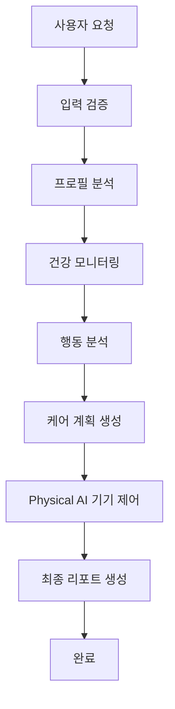

# 🐾 PetCare Physical AI Agent

**LangChain + LangGraph 기반 반려동물 관리 Physical AI Agent**

Physical AI 기기(로봇 청소기, 스마트 장난감, 자동급식기 등)를 연동하여 반려동물의 특성에 맞춘 맞춤형 관리 서비스를 제공하는 Multi-Agent 시스템

## 🏗️ 아키텍처 개요

PetCare Physical AI Agent는 다음 6개의 전문 Agent로 구성된 Multi-Agent 시스템입니다:

### 1. 🤖 전문 Agents

- **PetProfileAnalyzerAgent**: 반려동물 프로필 분석 전문가
- **HealthMonitorAgent**: 건강 모니터링 및 이상 감지 전문가
- **BehaviorAnalyzerAgent**: 행동 패턴 분석 전문가
- **PhysicalAIControllerAgent**: Physical AI 기기 제어 전문가
- **CarePlannerAgent**: 맞춤형 케어 계획 생성 전문가
- **PetAssistantAgent**: 종합 반려동물 어시스턴트 (Orchestrator)

### 2. 🔄 LangGraph 워크플로우



### 3. 🔌 Physical AI 기기 연동

- **로봇 청소기**: 배변 후 자동 청소, 위치 추적 기반 청소
- **스마트 장난감**: 활동량 기반 자동 놀이 제공
- **자동급식기**: 건강 상태 기반 급식량 조절
- **스마트 환경**: 조명/온도 자동 조절

### 4. 🛠️ MCP 서버 연동

- **Filesystem**: 데이터 저장 및 관리
- **g-search**: 반려동물 케어 정보 검색
- **fetch**: 외부 API 데이터 수집

## 🚀 빠른 시작

### 설치

```bash
# 의존성 설치
pip install -r requirements.txt

# 환경변수 설정
cp .env.example .env
# .env 파일을 편집하여 API 키들을 설정
```

### 실행 방법

```bash
# 메인 실행
python -m lang_graph.petcare_physical_ai_agent.main
```

### 사용 예시

```python
from lang_graph.petcare_physical_ai_agent.main import PetCarePhysicalAIAgent
from lang_graph.petcare_physical_ai_agent.llm.model_manager import ModelProvider

# Agent 초기화
agent = PetCarePhysicalAIAgent(preferred_provider=ModelProvider.GROQ)

# 워크플로우 실행
result = await agent.run_pet_care_workflow(
    user_input="우리 강아지가 최근 활동량이 줄었어요. 건강 체크하고 케어 계획을 만들어주세요.",
    pet_id="pet_001",
    pet_profile={
        "pet_id": "pet_001",
        "name": "뽀삐",
        "species": "dog",
        "breed": "골든 리트리버",
        "age": 24,  # 24개월
    }
)
```

## 📁 프로젝트 구조

```
lang_graph/petcare_physical_ai_agent/
├── __init__.py
├── main.py                 # 메인 진입점
├── agents/                 # 전문 Agents
│   ├── profile_analyzer.py
│   ├── health_monitor.py
│   ├── behavior_analyzer.py
│   ├── physical_ai_controller.py
│   ├── care_planner.py
│   └── pet_assistant.py
├── chains/                 # LangGraph 워크플로우
│   ├── state_management.py
│   └── petcare_chain.py
├── tools/                  # 도구 모음
│   ├── mcp_tools.py
│   ├── physical_ai_tools.py
│   ├── pet_tools.py
│   └── health_tools.py
├── llm/                    # LLM 관리
│   ├── model_manager.py
│   └── fallback_handler.py
├── config/                 # 설정
│   └── petcare_config.py
└── utils/                  # 유틸리티
    └── validators.py
```

## 🎯 주요 기능

### 1. 반려동물 프로필 분석
- 종류, 나이, 성격, 건강 상태 분석
- 일상 행동 패턴 학습
- 선호도 및 스트레스 요인 파악

### 2. Physical AI 기기 통합 제어
- 로봇 청소기: 반려동물 위치 추적, 배변 후 자동 청소
- 스마트 장난감: 활동량에 따른 자동 놀이 제공
- 자동급식기: 건강 상태 기반 급식량 조절
- 스마트 조명/온도: 반려동물 생체리듬에 맞춘 환경 조절

### 3. 건강 모니터링 및 알림
- 이상 행동 감지 및 분석
- 건강 데이터 추적 및 분석
- 수의사 상담 연결 (향후 구현)
- 예방 접종, 건강검진 알림

### 4. 맞춤형 케어 계획
- 운동량, 식사량, 놀이 시간 최적화
- 스트레스 완화 활동 제안
- 훈련 프로그램 추천

## 🔧 환경 설정

### 필수 환경변수

```bash
# LLM API Keys (최소 1개 필요)
GROQ_API_KEY=your_groq_api_key          # 우선 사용
OPENROUTER_API_KEY=your_openrouter_key  # 우선 사용
GOOGLE_API_KEY=your_google_api_key      # Fallback
OPENAI_API_KEY=your_openai_api_key      # Fallback
ANTHROPIC_API_KEY=your_anthropic_key    # Fallback
```

### 선택적 환경변수

```bash
# 디렉토리 설정
PETCARE_OUTPUT_DIR=petcare_reports
PETCARE_DATA_DIR=petcare_data
```

## 📊 Physical AI 연계 시나리오

### 시나리오 1: 배변 후 자동 청소
```
반려동물 배변 감지 → Agent 분석 → 로봇 청소기 자동 출동 → 
청소 완료 후 소독 → 주인에게 알림
```

### 시나리오 2: 활동량 낮을 때 놀이 제공
```
활동량 낮음 감지 → Agent 분석 → 스마트 장난감 활성화 → 
반려동물 반응 분석 → 놀이 강도 자동 조절
```

### 시나리오 3: 건강 기반 급식 조절
```
건강 데이터 분석 → Agent가 급식량 계산 → 
자동급식기에 명령 전송 → 급식 후 반응 모니터링
```

### 시나리오 4: 최적 수면 환경 유지
```
수면 패턴 학습 → Agent가 조명/온도 자동 조절 → 
최적 수면 환경 유지 → 건강 개선
```

## 🎯 비즈니스 가치

### 수익 모델
1. **구독 기반 SaaS**: Free/Basic/Premium/Pro 플랜
2. **Physical AI 기기 판매 수수료**: 10-15%
3. **데이터 기반 서비스**: 수의사 네트워크, 펫푸드 추천
4. **B2B 확장**: 펫호텔, 펫카페 솔루션 제공

### 예상 ROI
- **1년차**: ROI 174% (50,000 가입자, 2,500 프리미엄)
- **3년차**: ROI 8,000%+ (500,000 가입자, 40,000 프리미엄)

## 🛡️ 기술적 특징

- **LangChain 기반**: Multi-Agent 시스템
- **LangGraph**: 워크플로우 관리
- **Multi-Model LLM**: Groq/OpenRouter 우선, 자동 Fallback
- **Physical AI 연동**: 표준 API 기반 (MQTT, Home Assistant 등)
- **Production-Ready**: 에러 처리, 로깅, 모니터링

## 📝 라이선스

이 프로젝트는 MIT 라이선스 하에 배포됩니다.

---

**🐾 PetCare Physical AI Agent - AI가 반려동물의 완벽한 케어를 제공합니다!**

