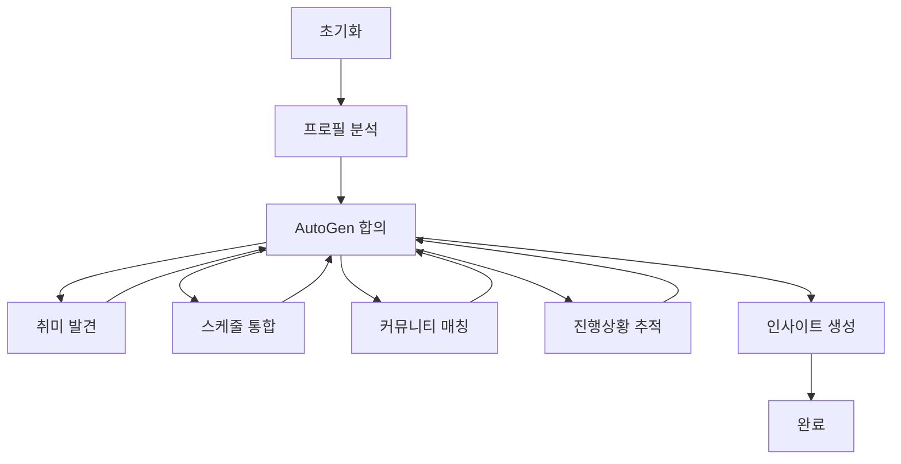

# 🎯 Hobby Starter Pack Agent (HSP Agent)

**AutoGen + LangGraph 하이브리드 아키텍처** 기반의 AI 취미 추천 시스템

## 🏗️ 아키텍처 개요

HSP Agent는 다음 4개의 핵심 컴포넌트로 구성된 하이브리드 AI 시스템입니다:

### 1. 🤖 AutoGen 에이전트 (합의 기반 의사결정)
- **ProfileAnalyst**: 사용자 프로필 분석 전문가
- **HobbyDiscoverer**: 취미 발견 및 추천 전문가  
- **ScheduleIntegrator**: 일정 통합 전문가
- **CommunityMatcher**: 커뮤니티 매칭 전문가
- **ProgressTracker**: 진행상황 추적 전문가
- **DecisionModerator**: 의사결정 중재자

### 2. 🔄 LangGraph 워크플로우 (작업 흐름 관리)


### 3. 🌉 A2A 프로토콜 브리지 (프레임워크 간 통신)
- AutoGen ↔ LangGraph 실시간 메시지 교환
- 합의 결과를 워크플로우에 자동 반영
- 에러 처리 및 빈 값 fallback 지원

### 4. 🔌 MCP 서버 연동 (외부 서비스 통합)
- **Google Calendar**: 일정 관리
- **Google Maps**: 위치 기반 추천
- **Weather API**: 날씨 기반 활동 추천
- **Social Media**: 커뮤니티 검색
- **E-commerce**: 취미 용품 추천
- **Education Platform**: 강의 및 튜토리얼
- **Fitness Tracker**: 운동 활동 추적
- **Music Platform**: 음악 관련 취미
- **Reading Platform**: 독서 관련 취미
- **Cooking Recipes**: 요리 관련 취미

## 🚀 빠른 시작

### 설치
```bash
# 의존성 설치
pip install -r requirements.txt

# 환경변수 설정 (선택사항)
cp .env.example .env
# .env 파일을 편집하여 API 키들을 설정
```

### 실행 방법

#### 1. API 서버 모드 (권장)
```bash
python app.py
# 또는
HSP_MODE=server python app.py
```
서버가 http://localhost:8000 에서 실행됩니다.

#### 2. 테스트 모드
```bash
HSP_MODE=test python app.py
```

#### 3. 테스트 후 서버 실행
```bash
HSP_MODE=both python app.py
```

## 📡 API 엔드포인트

### 메인 워크플로우
```bash
# 취미 추천 워크플로우 실행
curl -X POST "http://localhost:8000/api/workflow/run" \
  -H "Content-Type: application/json" \
  -d '{
    "user_input": "30대 직장인, 주말 취미 찾고 있음",
    "user_profile": {
      "age": 30,
      "occupation": "office_worker",
      "location": "Seoul",
      "interests": ["reading", "technology"],
      "available_time": "weekends"
    }
  }'
```

### 에이전트 합의
```bash
# 특정 주제에 대한 에이전트 합의 요청
curl -X POST "http://localhost:8000/api/agents/consensus" \
  -H "Content-Type: application/json" \
  -d '{
    "agents": ["ProfileAnalyst", "HobbyDiscoverer", "DecisionModerator"],
    "topic": "outdoor_hobby_recommendation",
    "context": {"season": "spring", "budget": "low"},
    "user_profile": {"age": 30, "fitness_level": "beginner"}
  }'
```

### MCP 서버 호출
```bash
# Google Maps로 근처 취미 장소 검색
curl -X POST "http://localhost:8000/api/mcp/call" \
  -H "Content-Type: application/json" \
  -d '{
    "server_name": "google_maps", 
    "capability": "search_places",
    "params": {"query": "photography studio near me"}
  }'
```

### A2A 메시지 전송
```bash
# 에이전트 간 직접 메시지 전송
curl -X POST "http://localhost:8000/api/a2a/send-message" \
  -H "Content-Type: application/json" \
  -d '{
    "sender_agent": "HobbyDiscoverer",
    "receiver_agent": "CommunityMatcher", 
    "message_type": "hobby_recommendation",
    "payload": {"recommended_hobby": "photography", "skill_level": "beginner"}
  }'
```

### 시스템 상태 확인
```bash
# 헬스 체크
curl http://localhost:8000/api/health

# MCP 서버 기능 목록
curl http://localhost:8000/api/mcp/capabilities

# 등록된 에이전트 상태
curl http://localhost:8000/api/agents/status
```

## 🔧 환경 설정

### 필수 환경변수
```bash
# Google Services
GOOGLE_MAPS_API_KEY=your_google_maps_api_key
OPENWEATHER_API_KEY=your_openweather_api_key

# OpenAI (AutoGen용)
OPENAI_API_KEY=your_openai_api_key
```

### 선택적 환경변수 (고급 기능)
```bash
# OAuth2 토큰들
GOOGLE_CALENDAR_TOKEN=your_google_calendar_token
SOCIAL_MEDIA_TOKEN=your_social_media_token
EDUCATION_PLATFORM_TOKEN=your_education_token
FITNESS_TRACKER_TOKEN=your_fitness_token
MUSIC_PLATFORM_TOKEN=your_music_token

# API 키들
ECOMMERCE_API_KEY=your_ecommerce_api_key
READING_PLATFORM_API_KEY=your_reading_api_key
RECIPE_API_KEY=your_recipe_api_key
```

## 🧪 테스트

### 단위 테스트
```bash
cd tests/unit
pytest test_autogen_agents.py
pytest test_mcp_manager.py
pytest test_a2a_bridge.py
```

### 통합 테스트
```bash
cd tests/integration
pytest test_workflow_integration.py
pytest test_api_endpoints.py
```

### E2E 테스트
```bash
cd tests/e2e
pytest test_full_workflow.py
```

## 📁 프로젝트 구조

```
langgraph/hobby_start_pack_agent/
├── app.py                 # 🚀 메인 애플리케이션 런처
├── main.py                # 📜 레거시 실행 스크립트
├── api/                   # 🌐 FastAPI REST API
│   └── main.py           
├── autogen/               # 🤖 AutoGen 에이전트들
│   ├── agents.py         # 6개 전문 에이전트
│   └── decision_engine.py # 의사결정 엔진
├── langgraph_workflow/    # 🔄 LangGraph 워크플로우
│   ├── state.py          # 상태 정의
│   └── workflow.py       # 워크플로우 구현
├── bridge/                # 🌉 A2A 프로토콜 브리지
│   └── a2a_bridge.py     # 프레임워크 간 통신
├── mcp/                   # 🔌 MCP 서버 매니저
│   └── manager.py        # 10개 외부 서비스 연동
├── db/                    # 💾 데이터베이스 모델
│   └── models.py         # SQLAlchemy 모델
└── tests/                 # 🧪 테스트 코드
    ├── unit/
    ├── integration/
    └── e2e/
```

## 🎯 주요 특징

### ✨ 핵심 원칙
- **빈 값 우선 (Empty Value First)**: 모든 초기값은 빈 값으로 시작
- **에이전트 기반 의사결정**: 하드코딩 없이 LLM이 모든 결정
- **프레임워크 중립성**: AutoGen과 LangGraph의 장점만 결합
- **에러 내성**: 모든 단계에서 빈 값 fallback 지원

### 🔄 하이브리드 아키텍처 장점
1. **AutoGen**: 다중 에이전트 합의를 통한 높은 품질의 의사결정
2. **LangGraph**: 복잡한 워크플로우의 체계적 관리
3. **A2A 브리지**: 두 프레임워크의 원활한 통신
4. **MCP 연동**: 실제 외부 서비스와의 데이터 교환

### 🛡️ 에러 처리
- MCP 서버 연결 실패 시 빈 값 반환
- 에이전트 합의 실패 시 기본 라우팅 적용
- 인증 실패 시 graceful degradation
- 모든 단계에서 상세한 에러 로깅

## 🤝 기여하기

1. Fork the repository
2. Create a feature branch (`git checkout -b feature/AmazingFeature`)
3. Commit your changes (`git commit -m 'Add some AmazingFeature'`)
4. Push to the branch (`git push origin feature/AmazingFeature`)
5. Open a Pull Request

## 📄 라이선스

이 프로젝트는 MIT 라이선스 하에 배포됩니다.

## 🙋‍♂️ 문의

프로젝트 관련 문의사항이나 버그 리포트는 GitHub Issues를 이용해주세요.

---

**🎯 HSP Agent - AI가 당신의 완벽한 취미를 찾아드립니다!** 