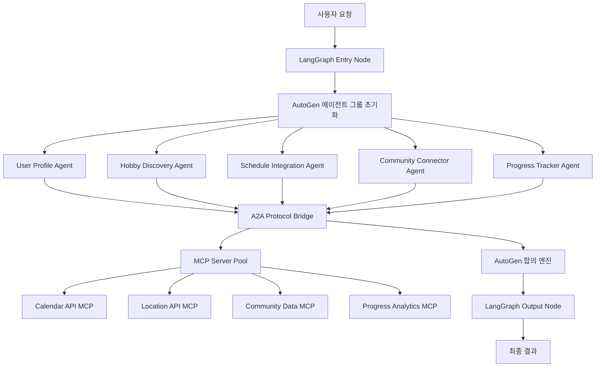

# 취미활동 스타터팩 에이전트 - 기술 명세서 및 아키텍처

## 🎯 프로젝트 개요

### 핵심 아키텍처 원칙
- **AutoGen 중심 에이전트 합의**: 에이전트 간 의사결정이 필요한 모든 부분은 AutoGen으로 처리
- **LangGraph 워크플로우 관리**: 전체 프로세스는 LangGraph로 구조화
- **A2A 프로토콜 브릿지**: 서로 다른 프레임워크 간 통신은 Agent-to-Agent 프로토콜 사용
- **MCP 서버 통합**: 외부 도구 및 데이터 소스는 Model Context Protocol로 연결
- **에이전트 기반 판단**: 모든 판단은 LLM 호출을 통한 에이전트가 수행, 하드코딩된 값 없음
- **빈 값 폴백**: 예외 상황에서는 반드시 빈 값만 반환

## 🧬 AutoGen + LangGraph 하이브리드 아키텍처

### 전체 시스템 플로우



### 핵심 상태 정의

```python
from typing import Dict, Any, List, Optional, TypedDict, Annotated
from langgraph.graph import StateGraph, END
from langgraph.checkpoint.memory import MemorySaver
from autogen import AssistantAgent, UserProxyAgent, GroupChat, GroupChatManager
import asyncio
from datetime import datetime

class HSPAgentState(TypedDict):
    """모든 상태는 에이전트가 동적으로 결정. 빈 값으로 초기화"""
    user_id: Annotated[str, "사용자 고유 ID"]
    agent_session: Annotated[Dict[str, Any], "AutoGen 세션 데이터"]
    workflow_context: Annotated[Dict[str, Any], "LangGraph 워크플로우 컨텍스트"]
    agent_consensus: Annotated[Dict[str, Any], "에이전트 간 합의 결과"]
    mcp_responses: Annotated[Dict[str, Any], "MCP 서버 응답 데이터"]
    a2a_messages: Annotated[List[Dict], "A2A 프로토콜 메시지"]
    current_decision_point: Annotated[str, "현재 의사결정 지점"]
    temporary_storage: Annotated[Dict[str, Any], "임시 데이터 저장소"]
    
    # 모든 기본값은 빈 값
    user_profile: Annotated[Dict[str, Any], ""] = {}
    hobby_recommendations: Annotated[List[Dict], ""] = []
    schedule_analysis: Annotated[Dict[str, Any], ""] = {}
    community_matches: Annotated[List[Dict], ""] = []
    progress_metrics: Annotated[Dict[str, Any], ""] = {}
    weekly_journal: Annotated[str, ""] = ""
    error_log: Annotated[List[str], ""] = []
```

## 🤖 AutoGen 에이전트 정의

### 전문 에이전트 구성

```python
class HSPAutoGenAgents:
    """AutoGen 기반 전문 에이전트들"""
    
    def __init__(self, llm_config: Dict[str, Any]):
        self.llm_config = llm_config
        self.agents = self._initialize_agents()
        
    def _initialize_agents(self) -> Dict[str, AssistantAgent]:
        """에이전트 초기화 - 모든 시스템 메시지는 에이전트가 LLM으로 동적 생성"""
        
        # 사용자 프로필 분석 전문가
        profile_analyst = AssistantAgent(
            name="ProfileAnalyst",
            system_message="",  # 빈 값, LLM이 동적으로 결정
            llm_config=self.llm_config,
            description="사용자의 성격, 관심사, 라이프스타일을 분석하여 맞춤형 프로필을 생성"
        )
        
        # 취미 발견 전문가
        hobby_discoverer = AssistantAgent(
            name="HobbyDiscoverer",
            system_message="",  # 빈 값, LLM이 동적으로 결정
            llm_config=self.llm_config,
            description="개인에게 최적화된 새로운 취미 활동을 발견하고 추천"
        )
        
        # 스케줄 통합 전문가
        schedule_integrator = AssistantAgent(
            name="ScheduleIntegrator",
            system_message="",  # 빈 값, LLM이 동적으로 결정
            llm_config=self.llm_config,
            description="일상 스케줄과 취미 활동을 효율적으로 통합"
        )
        
        # 커뮤니티 매칭 전문가
        community_matcher = AssistantAgent(
            name="CommunityMatcher",
            system_message="",  # 빈 값, LLM이 동적으로 결정
            llm_config=self.llm_config,
            description="취미 기반 커뮤니티와 동료를 찾아서 연결"
        )
        
        # 진행상황 추적 전문가
        progress_tracker = AssistantAgent(
            name="ProgressTracker",
            system_message="",  # 빈 값, LLM이 동적으로 결정
            llm_config=self.llm_config,
            description="취미 활동 진행상황을 추적하고 동기부여 제공"
        )
        
        # 의사결정 중재자
        decision_moderator = AssistantAgent(
            name="DecisionModerator",
            system_message="",  # 빈 값, LLM이 동적으로 결정
            llm_config=self.llm_config,
            description="에이전트 간 의견 차이를 조율하고 최종 의사결정 지원"
        )
        
        return {
            "profile_analyst": profile_analyst,
            "hobby_discoverer": hobby_discoverer,
            "schedule_integrator": schedule_integrator,
            "community_matcher": community_matcher,
            "progress_tracker": progress_tracker,
            "decision_moderator": decision_moderator
        }
    
    def create_consensus_chat(self, relevant_agents: List[str]) -> GroupChat:
        """특정 주제에 대한 에이전트 합의 채팅 생성"""
        selected_agents = [self.agents[name] for name in relevant_agents if name in self.agents]
        
        # UserProxyAgent 추가 (실행 권한)
        user_proxy = UserProxyAgent(
            name="UserProxy",
            human_input_mode="NEVER",
            max_consecutive_auto_reply=0,
            code_execution_config=False
        )
        
        selected_agents.append(user_proxy)
        
        return GroupChat(
            agents=selected_agents,
            messages=[],
            max_round=10,  # 에이전트가 동적으로 조정
            speaker_selection_method="auto"  # 자동 선택
        )
```

## 🕸️ LangGraph 워크플로우 정의

### 메인 워크플로우 구조

```python
from langgraph.graph import StateGraph, END
from langgraph.prebuilt import ToolExecutor

class HSPLangGraphWorkflow:
    """LangGraph 기반 메인 워크플로우"""
    
    def __init__(self, autogen_agents: HSPAutoGenAgents, mcp_manager: 'MCPServerManager'):
        self.autogen_agents = autogen_agents
        self.mcp_manager = mcp_manager
        self.workflow = self._build_workflow()
    
    def _build_workflow(self) -> StateGraph:
        """워크플로우 그래프 구축"""
        workflow = StateGraph(HSPAgentState)
        
        # 노드 정의
        workflow.add_node("initialize_session", self._initialize_session)
        workflow.add_node("analyze_user_profile", self._analyze_user_profile)
        workflow.add_node("discover_hobbies", self._discover_hobbies)
        workflow.add_node("integrate_schedule", self._integrate_schedule)
        workflow.add_node("match_communities", self._match_communities)
        workflow.add_node("track_progress", self._track_progress)
        workflow.add_node("generate_insights", self._generate_insights)
        workflow.add_node("autogen_consensus", self._autogen_consensus)
        
        # 엣지 정의 (조건부 라우팅)
        workflow.set_entry_point("initialize_session")
        
        workflow.add_edge("initialize_session", "analyze_user_profile")
        workflow.add_edge("analyze_user_profile", "autogen_consensus")
        
        workflow.add_conditional_edges(
            "autogen_consensus",
            self._route_next_step,
            {
                "discover_hobbies": "discover_hobbies",
                "integrate_schedule": "integrate_schedule",
                "match_communities": "match_communities",
                "track_progress": "track_progress",
                "generate_insights": "generate_insights",
                "END": END
            }
        )
        
        # 모든 노드에서 다시 합의로 돌아갈 수 있음
        workflow.add_edge("discover_hobbies", "autogen_consensus")
        workflow.add_edge("integrate_schedule", "autogen_consensus")
        workflow.add_edge("match_communities", "autogen_consensus")
        workflow.add_edge("track_progress", "autogen_consensus")
        workflow.add_edge("generate_insights", END)
        
        return workflow.compile(checkpointer=MemorySaver())
    
    def _initialize_session(self, state: HSPAgentState) -> HSPAgentState:
        """세션 초기화"""
        # 모든 초기화는 빈 값으로 시작
        state["agent_session"] = {}
        state["workflow_context"] = {}
        state["current_decision_point"] = "profile_analysis"
        return state
    
    def _route_next_step(self, state: HSPAgentState) -> str:
        """다음 단계 라우팅 - 에이전트 합의에 기반"""
        consensus = state.get("agent_consensus", {})
        return consensus.get("next_step", "END")
    
    async def _autogen_consensus(self, state: HSPAgentState) -> HSPAgentState:
        """AutoGen 에이전트들의 합의 과정"""
        current_decision = state.get("current_decision_point", "")
        
        # 의사결정 포인트에 따라 관련 에이전트 선택
        relevant_agents = self._select_relevant_agents(current_decision)
        
        # 합의 채팅 생성
        consensus_chat = self.autogen_agents.create_consensus_chat(relevant_agents)
        manager = GroupChatManager(groupchat=consensus_chat, llm_config=self.autogen_agents.llm_config)
        
        # 합의 과정 실행
        message = f"Current context: {current_decision}. State: {state}"
        result = await manager.a_chat(
            message=message,
            clear_history=False
        )
        
        # 합의 결과 저장
        state["agent_consensus"] = result if result else {}
        return state
    
    def _select_relevant_agents(self, decision_point: str) -> List[str]:
        """의사결정 포인트에 따른 관련 에이전트 선택"""
        agent_mapping = {
            "profile_analysis": ["profile_analyst", "decision_moderator"],
            "hobby_discovery": ["hobby_discoverer", "profile_analyst", "decision_moderator"],
            "schedule_integration": ["schedule_integrator", "decision_moderator"],
            "community_matching": ["community_matcher", "decision_moderator"],
            "progress_tracking": ["progress_tracker", "decision_moderator"],
            "final_insights": ["progress_tracker", "decision_moderator"]
        }
        return agent_mapping.get(decision_point, ["decision_moderator"])
```

## 🌉 A2A 프로토콜 브릿지

### Agent-to-Agent 통신 인터페이스

```python
import asyncio
import json
from typing import Dict, Any, List
from dataclasses import dataclass

@dataclass
class A2AMessage:
    """A2A 프로토콜 메시지 구조"""
    sender_agent: str
    receiver_agent: str
    message_type: str
    payload: Dict[str, Any]
    timestamp: str
    session_id: str

class A2AProtocolBridge:
    """AutoGen과 LangGraph 간 A2A 프로토콜 브릿지"""
    
    def __init__(self):
        self.message_queue = asyncio.Queue()
        self.agent_registry = {}
        self.active_sessions = {}
    
    async def register_agent(self, agent_id: str, agent_type: str, framework: str):
        """에이전트 등록"""
        self.agent_registry[agent_id] = {
            "type": agent_type,
            "framework": framework,
            "capabilities": [],  # 에이전트가 동적으로 결정
            "status": "active"
        }
    
    async def send_message(self, message: A2AMessage) -> Dict[str, Any]:
        """에이전트 간 메시지 전송"""
        await self.message_queue.put(message)
        return await self._route_message(message)
    
    async def _route_message(self, message: A2AMessage) -> Dict[str, Any]:
        """메시지 라우팅"""
        receiver_info = self.agent_registry.get(message.receiver_agent, {})
        
        if receiver_info.get("framework") == "autogen":
            return await self._handle_autogen_message(message)
        elif receiver_info.get("framework") == "langgraph":
            return await self._handle_langgraph_message(message)
        else:
            return {"error": "Unknown agent framework", "details": ""}
    
    async def _handle_autogen_message(self, message: A2AMessage) -> Dict[str, Any]:
        """AutoGen 에이전트 메시지 처리"""
        # AutoGen 에이전트와의 상호작용
        try:
            # 에이전트별 동적 처리
            return {"status": "processed", "result": {}}
        except Exception as e:
            return {"error": "AutoGen processing failed", "details": ""}
    
    async def _handle_langgraph_message(self, message: A2AMessage) -> Dict[str, Any]:
        """LangGraph 노드 메시지 처리"""
        # LangGraph 워크플로우와의 상호작용
        try:
            # 동적 워크플로우 처리
            return {"status": "processed", "result": {}}
        except Exception as e:
            return {"error": "LangGraph processing failed", "details": ""}

    async def create_consensus_session(self, participants: List[str], topic: str) -> str:
        """합의 세션 생성"""
        session_id = f"consensus_{topic}_{datetime.now().isoformat()}"
        self.active_sessions[session_id] = {
            "participants": participants,
            "topic": topic,
            "messages": [],
            "consensus_reached": False,
            "result": {}
        }
        return session_id
```

## 🔌 MCP 서버 통합 관리

### 취미 관련 MCP 서버 명세

```python
from typing import Dict, Any, List, Optional
import asyncio
import httpx

class MCPServerManager:
    """MCP 서버들을 통합 관리하는 매니저"""
    
    def __init__(self):
        self.servers = {}
        self.initialize_hobby_mcp_servers()
    
    def initialize_hobby_mcp_servers(self):
        """취미 관련 MCP 서버들 초기화"""
        
        # 1. 구글 캘린더 MCP 서버
        self.servers["google_calendar"] = {
            "name": "Google Calendar MCP",
            "url": "https://calendar-mcp.googleapis.com",
            "capabilities": [
                "create_event",
                "list_events",
                "update_event",
                "check_availability",
                "find_free_time"
            ],
            "authentication": "oauth2",
            "description": "일정 관리 및 취미 활동 스케줄링"
        }
        
        # 2. 구글 맵스 MCP 서버
        self.servers["google_maps"] = {
            "name": "Google Maps MCP",
            "url": "https://maps-mcp.googleapis.com",
            "capabilities": [
                "search_places",
                "get_directions",
                "find_nearby",
                "geocode_address",
                "get_place_details"
            ],
            "authentication": "api_key",
            "description": "지역 기반 취미 장소 및 커뮤니티 검색"
        }
        
        # 3. 날씨 정보 MCP 서버
        self.servers["weather_api"] = {
            "name": "Weather MCP",
            "url": "https://weather-mcp.openweathermap.org",
            "capabilities": [
                "current_weather",
                "forecast",
                "weather_alerts",
                "historical_weather"
            ],
            "authentication": "api_key",
            "description": "날씨 기반 야외 취미 활동 추천"
        }
        
        # 4. 소셜 미디어 MCP 서버 (커뮤니티 검색)
        self.servers["social_search"] = {
            "name": "Social Media MCP",
            "url": "https://social-mcp.example.com",
            "capabilities": [
                "search_groups",
                "find_communities",
                "get_group_info",
                "search_events"
            ],
            "authentication": "oauth2",
            "description": "취미 관련 소셜 그룹 및 커뮤니티 검색"
        }
        
        # 5. 전자상거래 MCP 서버 (취미 용품)
        self.servers["ecommerce"] = {
            "name": "E-commerce MCP",
            "url": "https://ecommerce-mcp.example.com",
            "capabilities": [
                "search_products",
                "get_product_info",
                "compare_prices",
                "check_availability"
            ],
            "authentication": "api_key",
            "description": "취미 관련 용품 및 도구 검색"
        }
        
        # 6. 교육 플랫폼 MCP 서버
        self.servers["education"] = {
            "name": "Education MCP",
            "url": "https://education-mcp.example.com",
            "capabilities": [
                "search_courses",
                "find_tutorials",
                "get_course_info",
                "search_instructors"
            ],
            "authentication": "oauth2",
            "description": "취미 관련 강의 및 튜토리얼 검색"
        }
        
        # 7. 피트니스 트래킹 MCP 서버
        self.servers["fitness_tracker"] = {
            "name": "Fitness Tracker MCP",
            "url": "https://fitness-mcp.example.com",
            "capabilities": [
                "log_activity",
                "get_stats",
                "set_goals",
                "track_progress"
            ],
            "authentication": "oauth2",
            "description": "운동 관련 취미 활동 추적"
        }
        
        # 8. 음악 플랫폼 MCP 서버
        self.servers["music_platform"] = {
            "name": "Music Platform MCP",
            "url": "https://music-mcp.example.com",
            "capabilities": [
                "search_music",
                "create_playlist",
                "find_similar",
                "get_recommendations"
            ],
            "authentication": "oauth2",
            "description": "음악 관련 취미 활동 지원"
        }
        
        # 9. 독서 플랫폼 MCP 서버
        self.servers["reading_platform"] = {
            "name": "Reading Platform MCP",
            "url": "https://reading-mcp.example.com",
            "capabilities": [
                "search_books",
                "get_book_info",
                "find_similar",
                "track_reading"
            ],
            "authentication": "api_key",
            "description": "독서 관련 취미 활동 지원"
        }
        
        # 10. 요리 레시피 MCP 서버
        self.servers["cooking_recipes"] = {
            "name": "Cooking Recipes MCP",
            "url": "https://recipes-mcp.example.com",
            "capabilities": [
                "search_recipes",
                "get_recipe_details",
                "find_ingredients",
                "calculate_nutrition"
            ],
            "authentication": "api_key",
            "description": "요리 관련 취미 활동 지원"
        }
    
    async def call_mcp_server(self, server_name: str, capability: str, params: Dict[str, Any]) -> Dict[str, Any]:
        """MCP 서버 호출"""
        server = self.servers.get(server_name, {})
        if not server:
            return {"error": "Server not found", "details": ""}
        
        if capability not in server.get("capabilities", []):
            return {"error": "Capability not supported", "details": ""}
        
        try:
            async with httpx.AsyncClient() as client:
                response = await client.post(
                    f"{server['url']}/mcp/{capability}",
                    json=params,
                    headers=await self._get_auth_headers(server_name)
                )
                return response.json() if response.status_code == 200 else {"error": "Request failed", "details": ""}
        except Exception as e:
            return {"error": "Connection failed", "details": ""}
    
    async def _get_auth_headers(self, server_name: str) -> Dict[str, str]:
        """인증 헤더 생성"""
        server = self.servers.get(server_name, {})
        auth_type = server.get("authentication", "")
        
        # 에이전트가 동적으로 인증 정보 관리
        return {}

    def get_available_capabilities(self) -> Dict[str, List[str]]:
        """사용 가능한 모든 MCP 서버 기능 목록"""
        capabilities = {}
        for server_name, server_info in self.servers.items():
            capabilities[server_name] = server_info.get("capabilities", [])
        return capabilities
```

## 🧠 에이전트 기반 의사결정 시스템

### LLM 기반 동적 판단 로직

```python
class AgentDecisionEngine:
    """모든 판단을 에이전트가 LLM 호출로 수행하는 엔진"""
    
    def __init__(self, llm_config: Dict[str, Any]):
        self.llm_config = llm_config
        self.decision_history = []
    
    async def make_hobby_recommendation_decision(self, user_context: Dict[str, Any]) -> Dict[str, Any]:
        """취미 추천 의사결정 - 하드코딩 없이 순수 LLM 판단"""
        
        prompt = f"""
        사용자 컨텍스트를 분석하여 적절한 취미를 추천해주세요.
        
        사용자 정보:
        {json.dumps(user_context, ensure_ascii=False, indent=2)}
        
        다음 사항들을 고려하여 추천해주세요:
        1. 사용자의 성격과 성향
        2. 현재 생활 패턴과 스케줄
        3. 관심사와 선호도
        4. 예산과 시간 제약
        5. 지역적 접근성
        
        응답은 반드시 JSON 형태로 해주세요:
        {{
            "recommendations": [
                {{
                    "hobby_name": "취미 이름",
                    "reason": "추천 이유",
                    "difficulty": "초급/중급/고급",
                    "time_commitment": "시간 투자 정도",
                    "budget_range": "예산 범위",
                    "confidence_score": 0.85
                }}
            ],
            "reasoning": "전체적인 추천 근거"
        }}
        
        만약 충분한 정보가 없다면 빈 배열을 반환해주세요.
        """
        
        try:
            # LLM 호출하여 동적 결정
            response = await self._call_llm(prompt)
            result = json.loads(response) if response else {"recommendations": [], "reasoning": ""}
            
            # 의사결정 이력 저장
            self.decision_history.append({
                "decision_type": "hobby_recommendation",
                "timestamp": datetime.now().isoformat(),
                "input_context": user_context,
                "result": result
            })
            
            return result
            
        except Exception as e:
            # 예외 시 빈 값 반환
            return {"recommendations": [], "reasoning": ""}
    
    async def analyze_schedule_compatibility(self, schedule_data: Dict[str, Any], hobby_requirements: Dict[str, Any]) -> Dict[str, Any]:
        """스케줄 호환성 분석 - LLM 기반 동적 판단"""
        
        prompt = f"""
        사용자의 스케줄과 취미 요구사항을 분석하여 호환성을 판단해주세요.
        
        현재 스케줄:
        {json.dumps(schedule_data, ensure_ascii=False, indent=2)}
        
        취미 요구사항:
        {json.dumps(hobby_requirements, ensure_ascii=False, indent=2)}
        
        다음을 분석해주세요:
        1. 시간적 호환성
        2. 에너지 레벨 매칭
        3. 일정 충돌 가능성
        4. 최적 시간대 제안
        
        응답은 JSON 형태로:
        {{
            "compatibility_score": 0.8,
            "available_time_slots": [
                {{
                    "day": "월요일",
                    "time_range": "19:00-21:00",
                    "confidence": 0.9
                }}
            ],
            "potential_conflicts": ["리스트"],
            "optimization_suggestions": ["제안사항들"],
            "integration_strategy": "통합 전략"
        }}
        
        정보가 부족하면 빈 객체를 반환해주세요.
        """
        
        try:
            response = await self._call_llm(prompt)
            return json.loads(response) if response else {}
        except Exception:
            return {}
    
    async def evaluate_community_match(self, user_profile: Dict[str, Any], community_data: Dict[str, Any]) -> Dict[str, Any]:
        """커뮤니티 매칭 평가 - LLM 기반 동적 판단"""
        
        prompt = f"""
        사용자 프로필과 커뮤니티 정보를 비교하여 매칭 적합성을 평가해주세요.
        
        사용자 프로필:
        {json.dumps(user_profile, ensure_ascii=False, indent=2)}
        
        커뮤니티 정보:
        {json.dumps(community_data, ensure_ascii=False, indent=2)}
        
        다음 기준으로 평가:
        1. 관심사 일치도
        2. 활동 스타일 호환성
        3. 경험 레벨 적합성
        4. 지역적 접근성
        5. 커뮤니티 활성도
        
        JSON 응답:
        {{
            "match_score": 0.85,
            "strength_areas": ["강점 영역들"],
            "concern_areas": ["우려 영역들"],
            "recommendation": "추천/보류/비추천",
            "integration_tips": ["참여 팁들"]
        }}
        
        평가가 어려우면 빈 객체를 반환해주세요.
        """
        
        try:
            response = await self._call_llm(prompt)
            return json.loads(response) if response else {}
        except Exception:
            return {}
    
    async def generate_weekly_insights(self, activity_data: Dict[str, Any]) -> Dict[str, Any]:
        """주간 인사이트 생성 - LLM 기반 동적 생성"""
        
        prompt = f"""
        사용자의 주간 활동 데이터를 분석하여 인사이트를 생성해주세요.
        
        활동 데이터:
        {json.dumps(activity_data, ensure_ascii=False, indent=2)}
        
        다음을 포함한 인사이트 생성:
        1. 성취도 분석
        2. 패턴 발견
        3. 개선 영역
        4. 다음 주 목표 제안
        5. 동기부여 메시지
        
        JSON 응답:
        {{
            "achievement_score": 0.75,
            "key_insights": ["주요 인사이트들"],
            "progress_trends": ["진행 트렌드"],
            "improvement_areas": ["개선 영역"],
            "next_week_goals": ["다음 주 목표들"],
            "motivational_message": "격려 메시지",
            "personalized_journal": "개인화된 일지 내용"
        }}
        
        데이터가 부족하면 빈 값들로 응답해주세요.
        """
        
        try:
            response = await self._call_llm(prompt)
            return json.loads(response) if response else {
                "achievement_score": 0,
                "key_insights": [],
                "progress_trends": [],
                "improvement_areas": [],
                "next_week_goals": [],
                "motivational_message": "",
                "personalized_journal": ""
            }
        except Exception:
            return {
                "achievement_score": 0,
                "key_insights": [],
                "progress_trends": [],
                "improvement_areas": [],
                "next_week_goals": [],
                "motivational_message": "",
                "personalized_journal": ""
            }
    
    async def _call_llm(self, prompt: str) -> str:
        """LLM 호출 - 실제 구현 시 사용할 LLM API"""
        # 실제 LLM API 호출 로직
        # OpenAI, Anthropic, Google Gemini 등
        try:
            # LLM API 호출
            return ""  # 실제 응답
        except Exception:
            return ""  # 실패 시 빈 문자열
```

## 📋 통합 실행 계획

### 개발 단계별 구현 계획

```python
class HSPAgentDevelopmentPlan:
    """취미활동 스타터팩 에이전트 개발 계획"""
    
    PHASE_1_FOUNDATION = {
        "기간": "1-2주",
        "목표": "기본 아키텍처 구축",
        "작업": [
            "AutoGen 에이전트 기본 구조 설정",
            "LangGraph 워크플로우 스켈레톤 구축",
            "A2A 프로토콜 브릿지 기본 구현",
            "핵심 MCP 서버 연결 (Google Calendar, Maps)",
            "에이전트 기반 의사결정 엔진 프로토타입"
        ]
    }
    
    PHASE_2_CORE_AGENTS = {
        "기간": "2-3주",
        "목표": "핵심 에이전트 완성",
        "작업": [
            "ProfileAnalyst 에이전트 완성",
            "HobbyDiscoverer 에이전트 구현",
            "ScheduleIntegrator 에이전트 구현",
            "AutoGen 합의 메커니즘 고도화",
            "MCP 서버 풀 확장 (날씨, 소셜미디어, 교육)"
        ]
    }
    
    PHASE_3_ADVANCED_FEATURES = {
        "기간": "2-3주",
        "목표": "고급 기능 구현",
        "작업": [
            "CommunityMatcher 에이전트 구현",
            "ProgressTracker 에이전트 구현",
            "A2A 프로토콜 고도화",
            "에이전트 간 복잡한 협업 시나리오 구현",
            "실시간 학습 및 적응 메커니즘"
        ]
    }
    
    PHASE_4_INTEGRATION_TESTING = {
        "기간": "1-2주",
        "목표": "통합 테스트 및 최적화",
        "작업": [
            "전체 시스템 통합 테스트",
            "에이전트 간 통신 성능 최적화",
            "MCP 서버 연결 안정성 확보",
            "사용자 시나리오 기반 E2E 테스트",
            "오류 처리 및 폴백 메커니즘 강화"
        ]
    }
    
    PHASE_5_DEPLOYMENT = {
        "기간": "1주",
        "목표": "배포 및 모니터링",
        "작업": [
            "프로덕션 환경 배포",
            "모니터링 및 로깅 시스템 구축",
            "사용자 피드백 수집 메커니즘",
            "지속적 개선 파이프라인 구축"
        ]
    }

# 프로젝트 메타데이터
PROJECT_METADATA = {
    "project_name": "HSP (Hobby Starter Pack) Agent",
    "version": "2.0.0",
    "architecture": "AutoGen + LangGraph + A2A + MCP",
    "last_updated": "2024-12-19",
    "team": "HSP Agent Development Team",
    "technologies": [
        "AutoGen (에이전트 협업)",
        "LangGraph (워크플로우 관리)", 
        "A2A Protocol (프레임워크 간 통신)",
        "MCP Servers (외부 도구 연결)",
        "FastAPI (API 서버)",
        "PostgreSQL (데이터베이스)",
        "Redis (캐싱)",
        "Docker (컨테이너화)"
    ],
    "key_principles": [
        "에이전트 기반 의사결정 (하드코딩 금지)",
        "빈 값 폴백 정책",
        "AutoGen 기반 합의 메커니즘",
        "LangGraph 워크플로우 구조화",
        "A2A 프로토콜 브릿징",
        "MCP 서버 표준화"
    ]
}
```

---

**문서 버전**: 2.0.0  
**최종 업데이트**: 2024년 12월 19일  
**작성자**: HSP Agent 개발팀  

이 기술 명세서는 AutoGen과 LangGraph의 하이브리드 아키텍처를 기반으로 하며, A2A 프로토콜과 MCP 서버를 활용한 차세대 에이전트 시스템의 설계도입니다.
