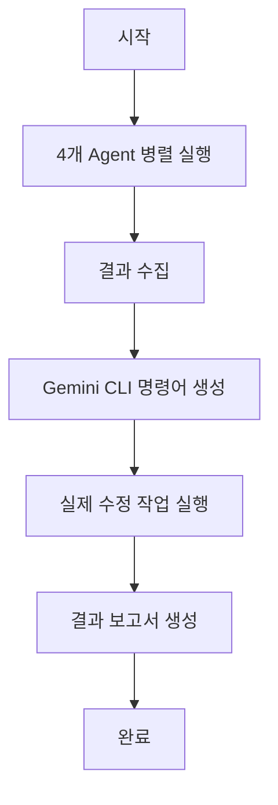
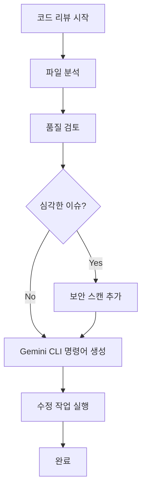
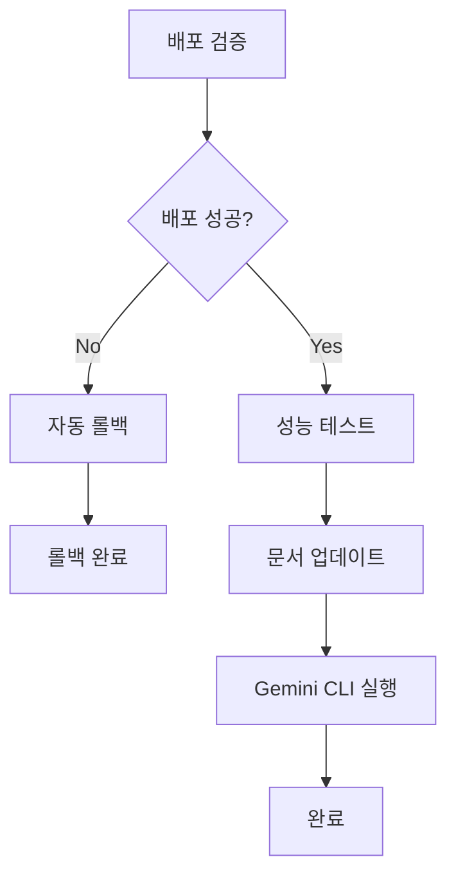

# 🤖 Multi-Agent Automation Service

**실제 mcp-agent 라이브러리 기반 Multi-Agent 시스템**
**Gemini CLI를 통한 최종 명령 실행**

## 📋 개요

이 프로젝트는 **4개 전문 Agent**들이 협업하여 코드 리뷰, 자동 문서화, 성능 테스트, 보안/배포 검증을 수행하고, **Gemini CLI**를 통해 실제 수정 작업을 실행하는 자동화 시스템입니다.

### 🌟 주요 특징

- **🔍 코드 리뷰 Agent**: 코드 품질 검토 및 보안 취약점 발견
- **📚 문서화 Agent**: 자동 문서 생성 및 업데이트
- **⚡ 성능 테스트 Agent**: 성능 분석 및 최적화 제안
- **🛡️ 보안/배포 Agent**: 보안 스캔 및 배포 검증
- **🤖 Gemini CLI 통합**: 실제 수정 작업 실행
- **⏰ 스케줄링**: 자동화된 워크플로우 실행
- **📊 실시간 모니터링**: 실행 상태 및 결과 추적

## 🏗️ 아키텍처

```
Multi-Agent Automation Service
├── CodeReviewAgent (코드 리뷰)
├── DocumentationAgent (자동 문서화)
├── PerformanceTestAgent (성능 테스트)
├── SecurityDeploymentAgent (보안/배포)
├── MultiAgentOrchestrator (조율)
└── GeminiCLIExecutor (최종 실행)
```

### Agent 역할 분담

| Agent | 역할 | 주요 기능 |
|-------|------|-----------|
| **CodeReviewAgent** | 코드 품질 검토 | 코드 분석, 보안 취약점 발견, 개선사항 제안 |
| **DocumentationAgent** | 자동 문서화 | README 업데이트, API 문서 생성, 변경사항 기록 |
| **PerformanceTestAgent** | 성능 분석 | 성능 병목 지점 발견, 최적화 제안, 테스트 생성 |
| **SecurityDeploymentAgent** | 보안/배포 | 보안 스캔, 배포 검증, 자동 롤백 |

## 🚀 설치 및 실행

### 필수 요구사항

- Python 3.11+
- Node.js 18+ (MCP 서버용)
- Gemini CLI 설치

### 설치

```bash
# 1. 저장소 클론
git clone <repository-url>
cd multi_agent_automation_service

# 2. Python 의존성 설치
pip install -r requirements.txt

# 3. MCP 서버 설치
npm install -g @modelcontextprotocol/server-filesystem
npm install -g @playwright/mcp@latest
npm install -g @modelcontextprotocol/server-github

# 4. Gemini CLI 설치 (별도 설치 필요)
# https://ai.google.dev/gemini-api/docs/quickstart
```

### 설정

1. **환경 변수 설정** (`.env` 파일):
```bash
OPENAI_API_KEY=your_openai_api_key
GEMINI_API_KEY=your_gemini_api_key
```

2. **MCP 설정 확인** (`mcp_agent.config.yaml`):
```yaml
mcp:
  servers:
    filesystem:
      command: "npx"
      args: ["@modelcontextprotocol/server-filesystem"]
    playwright:
      command: "npx"
      args: ["@playwright/mcp@latest"]
```

## 📖 사용법

### 1. 전체 자동화 실행

```bash
python -m multi_agent_automation_service full
```

**실행 과정:**
1. 4개 Agent가 병렬로 작업 수행
2. 결과 수집 및 분석
3. Gemini CLI 명령어 생성
4. 실제 수정 작업 실행

### 2. 코드 리뷰 워크플로우

```bash
python -m multi_agent_automation_service review --paths src/ tests/
```

**실행 과정:**
1. 코드 리뷰 Agent 실행
2. 심각한 이슈 발견 시 보안 스캔 추가
3. Gemini CLI를 통한 수정 작업

### 3. 배포 워크플로우

```bash
python -m multi_agent_automation_service deploy --deployment-id deployment-123
```

**실행 과정:**
1. 배포 검증
2. 실패 시 자동 롤백
3. 성공 시 성능 테스트 및 문서 업데이트

### 4. 개별 Agent 실행

```bash
python -m multi_agent_automation_service individual --paths src/
```

### 5. 스케줄러 시작

```bash
python -m multi_agent_automation_service scheduler
```

**스케줄:**
- 매일 새벽 2시: 전체 자동화
- 매주 월요일 오전 9시: 코드 리뷰 워크플로우
- 매시간: 배포 상태 확인

### 6. 상태 확인

```bash
python -m multi_agent_automation_service status
```

## 📊 예시 결과

### 코드 리뷰 결과

```
코드 리뷰 결과 요약
==================

📁 검토된 파일: 15개
🔍 발견된 이슈: 8개
🚨 보안 취약점: 2개
💡 개선 제안: 12개
⭐ 코드 품질 점수: 0.78/1.0

주요 이슈:
- src/auth.py:45 - SQL 인젝션 취약점 발견
- src/utils.py:23 - 메모리 누수 가능성
- tests/test_auth.py:67 - 테스트 커버리지 부족

Gemini CLI 명령어 (5개):
- gemini 'SQL 인젝션 취약점을 수정해줘'
- gemini '메모리 누수 문제를 해결해줘'
- gemini '테스트 커버리지를 개선해줘'
```

### 전체 자동화 결과

```
Multi-Agent 자동화 실행 요약
===========================

📊 Agent 실행 결과:
- code_review: ✅ 성공
- documentation: ✅ 성공
- performance_test: ✅ 성공
- security_deployment: ✅ 성공

🔧 Gemini CLI 명령어 실행: 15개
- 성공: 14개
- 실패: 1개
```

## 🛠️ 기술 스택

### 핵심 라이브러리

- **mcp-agent**: 실제 MCP Agent 라이브러리
- **MCP Servers**: 파일시스템, Playwright, GitHub 등
- **Gemini CLI**: 최종 명령 실행
- **asyncio**: 비동기 처리
- **schedule**: 스케줄링

### MCP 서버

- `@modelcontextprotocol/server-filesystem`: 파일 시스템 접근
- `@playwright/mcp@latest`: 웹 브라우저 자동화
- `@modelcontextprotocol/server-github`: GitHub 접근
- `mcp-server-fetch`: 웹 콘텐츠 가져오기

## 📁 프로젝트 구조

```
multi_agent_automation_service/
├── agents/
│   ├── __init__.py
│   ├── code_review_agent.py      # 코드 리뷰 Agent
│   ├── documentation_agent.py    # 문서화 Agent
│   ├── performance_test_agent.py # 성능 테스트 Agent
│   └── security_deployment_agent.py # 보안/배포 Agent
├── orchestrator.py               # Multi-Agent 조율
├── gemini_cli_executor.py        # Gemini CLI 실행
├── main.py                       # 메인 실행 파일
├── mcp_agent.config.yaml         # MCP 설정
├── requirements.txt              # Python 의존성
└── README.md                     # 프로젝트 문서
```

## 🔄 워크플로우

### 1. 전체 자동화 워크플로우



### 2. 코드 리뷰 워크플로우



### 3. 배포 워크플로우



## 📈 모니터링

### 실시간 모니터링

- **Agent 실행 상태**: 성공/실패 추적
- **Gemini CLI 실행**: 명령어별 결과 추적
- **성능 메트릭**: 실행 시간, 리소스 사용량
- **오류 로그**: 상세한 오류 정보

### 알림 시스템

- **이메일 알림**: 중요 이슈 발견 시
- **Slack 통합**: 실시간 상태 업데이트
- **웹훅**: 외부 시스템 연동

## 🔧 개발 가이드

### 새로운 Agent 추가

1. `agents/` 디렉토리에 새 Agent 클래스 생성
2. `Orchestrator`에 Agent 등록
3. `main.py`에 실행 모드 추가
4. 테스트 코드 작성

### MCP 서버 추가

1. `mcp_agent.config.yaml`에 서버 설정 추가
2. Agent에서 `gen_client` 사용
3. 도구 호출 로직 구현

### Gemini CLI 명령어 커스터마이징

1. `GeminiCLIExecutor` 클래스 수정
2. 명령어 템플릿 추가
3. 실행 결과 파싱 로직 개선

## 🐛 문제 해결

### 일반적인 문제

1. **MCP 서버 연결 실패**
   ```bash
   # MCP 서버 재설치
   npm install -g @modelcontextprotocol/server-filesystem
   ```

2. **Gemini CLI 실행 실패**
   ```bash
   # Gemini CLI 재설치 및 인증
   gemini auth
   ```

3. **메모리 부족**
   ```bash
   # 동시 실행 Agent 수 제한
   export MAX_CONCURRENT_AGENTS=2
   ```

### 로그 확인

```bash
# 상세 로그 확인
tail -f logs/multi_agent_automation.log

# 오류만 필터링
grep "ERROR" logs/multi_agent_automation.log
```

## 🚀 성능 최적화

### 병렬 처리 최적화

- **Agent 병렬 실행**: 4개 Agent 동시 실행
- **파일 처리 최적화**: 청크 단위 처리
- **메모리 관리**: 가비지 컬렉션 최적화

### 캐싱 전략

- **결과 캐싱**: 중복 작업 방지
- **파일 캐싱**: 변경된 파일만 처리
- **명령어 캐싱**: 동일 명령어 재사용

## 🤝 기여하기

1. Fork the repository
2. Create a feature branch
3. Make your changes
4. Add tests
5. Submit a pull request

### 개발 환경 설정

```bash
# 개발 의존성 설치
pip install -r requirements-dev.txt

# 테스트 실행
pytest tests/

# 코드 포맷팅
black srcs/
isort srcs/

# 린팅
flake8 srcs/
mypy srcs/
```

## 📄 라이선스

MIT License - 자세한 내용은 [LICENSE](LICENSE) 파일을 참조하세요.

## 🗺️ 로드맵

### v1.1 (예정)
- [ ] 웹 UI 대시보드 추가
- [ ] 더 많은 MCP 서버 지원
- [ ] 실시간 협업 기능

### v1.2 (예정)
- [ ] 머신러닝 기반 예측 분석
- [ ] 고급 스케줄링 기능
- [ ] API 엔드포인트 제공

### v2.0 (예정)
- [ ] 분산 실행 지원
- [ ] 플러그인 시스템
- [ ] 엔터프라이즈 기능

---

**Made with ❤️ using 실제 mcp-agent 라이브러리 + Gemini CLI** 