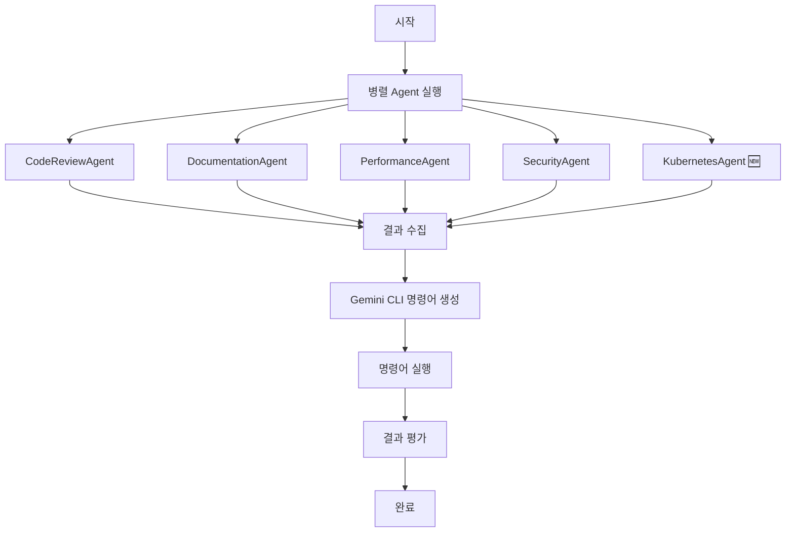
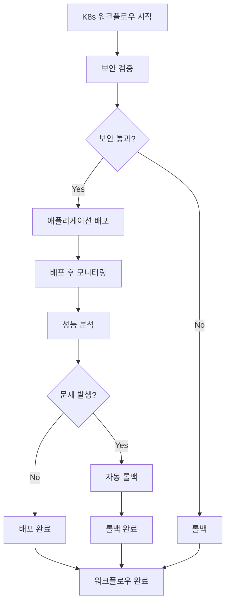

# Multi-Agent Automation Service

실제 `mcp_agent` 라이브러리를 사용한 코드 리뷰, 자동 문서화, 성능 테스트, 보안 검증, **Kubernetes 제어**를 담당하는 Multi-Agent 시스템입니다. Gemini CLI를 통한 최종 명령어 실행을 지원합니다.

## 🎯 주요 기능

### 🤖 전문 Agent들
- **CodeReviewAgent**: 코드 품질 분석, 버그 식별, 개선 제안
- **DocumentationAgent**: 자동 문서화, README/API 문서 생성
- **PerformanceAgent**: 성능 분석, 병목 지점 식별, 최적화 제안
- **SecurityAgent**: 보안 취약점 스캔, 배포 검증, 자동 롤백
- **KubernetesAgent**: 🆕 Kubernetes 클러스터 제어, 배포 관리, 모니터링

### 🔧 핵심 기능
- **실제 mcp_agent 라이브러리 사용**: 표준 MCP 프로토콜 기반
- **동적 Gemini CLI 명령어 생성**: LLM이 분석 결과를 바탕으로 명령어 생성
- **Multi-Agent 조율**: Orchestrator를 통한 효율적인 Agent 협업
- **병렬 처리**: 여러 Agent의 동시 실행으로 성능 최적화
- **실시간 모니터링**: 실행 상태 및 결과 추적
- **Kubernetes 통합**: 🆕 실제 K8s 클러스터 제어 및 관리

## 🏗️ 아키텍처

```
┌──────────────────────────────────────────────────────────────┐
│                    Multi-Agent Orchestrator                  │
├──────────────────────────────────────────────────────────────┤
│  ┌─────────────┐ ┌─────────────┐ ┌─────────────┐ ┌─────────┐ │
│  │ Code Review │ │Documentation│ │Performance  │ │Security │ │
│  │   Agent     │ │   Agent     │ │   Agent     │ │ Agent   │ │
│  └─────────────┘ └─────────────┘ └─────────────┘ └─────────┘ │
│                                                              │
│  ┌─────────────────────────────────────────────────────────┐ │
│  │              Kubernetes Agent 🆕                        │ │
│  │  • 애플리케이션 배포                                       │ │
│  │  • 스케일링 및 업데이트                                    │ │
│  │  • 설정 관리 (ConfigMap/Secret)                           │ │
│  │  • 모니터링 및 로그 분석                                   │ │
│  │  • 롤백 및 복구 작업                                       │ │
│  │  • 클러스터 상태 진단                                      │ │
│  └─────────────────────────────────────────────────────────┘ │
├─────────────────────────────────────────────────────────────┤
│                    Gemini CLI Executor                      │
│                (동적 명령어 생성 및 실행)                      │
└─────────────────────────────────────────────────────────────┘
```

## 🚀 설치 및 설정

### 1. 의존성 설치
```bash
pip install -r requirements.txt
```

### 2. 환경 변수 설정
```bash
# OpenAI API 키
export OPENAI_API_KEY="your-openai-api-key"

# Gemini CLI 설정 (선택사항)
export GEMINI_API_KEY="your-gemini-api-key"
```

### 3. kubectl 설치 확인 (Kubernetes 기능 사용시)
```bash
# kubectl 설치 확인
kubectl version --client

# 클러스터 연결 확인
kubectl cluster-info
```

## 📖 사용법

### 전체 자동화 워크플로우
```bash
# 전체 자동화 실행
python -m srcs.multi_agent_automation_service.main --workflow full --target srcs

# 또는 간단히
python -m srcs.multi_agent_automation_service.main
```

### Kubernetes 워크플로우 🆕
```bash
# Kubernetes 애플리케이션 배포 및 관리
python -m srcs.multi_agent_automation_service.main \
  --workflow kubernetes \
  --app-name myapp \
  --config-path k8s/

# 특정 네임스페이스에서 K8s 작업
python -m srcs.multi_agent_automation_service.main \
  --workflow kubernetes \
  --app-name production-app \
  --config-path production/k8s/
```

### 개별 워크플로우
```bash
# 코드 리뷰만 실행
python -m srcs.multi_agent_automation_service.main --workflow code_review --target srcs

# 배포 워크플로우 실행
python -m srcs.multi_agent_automation_service.main --workflow deployment --target srcs
```

### 개별 Agent 실행
```bash
# 개별 Agent 실행
python -m srcs.multi_agent_automation_service.main --agent code_review --target srcs
python -m srcs.multi_agent_automation_service.main --agent documentation --target srcs
python -m srcs.multi_agent_automation_service.main --agent performance --target srcs
python -m srcs.multi_agent_automation_service.main --agent security --target srcs
python -m srcs.multi_agent_automation_service.main --agent kubernetes --target k8s/  # 🆕
```

### 요약 정보 확인
```bash
# 전체 요약 정보 표시
python -m srcs.multi_agent_automation_service.main --summary
```

## 🐳 Kubernetes 기능 상세 설명 🆕

### KubernetesAgent 주요 기능

#### 1. 애플리케이션 배포
```python
# 애플리케이션 배포
result = await kubernetes_agent.deploy_application("myapp", "k8s/")
print(f"Deployment Status: {result.status}")
print(f"Generated Commands: {len(result.gemini_commands)}")
```

#### 2. 배포 스케일링
```python
# 배포 스케일링
result = await kubernetes_agent.scale_deployment("myapp", "default", 5)
print(f"Scaling Status: {result.status}")
```

#### 3. 설정 업데이트
```python
# ConfigMap 업데이트
config_data = {"DATABASE_URL": "postgresql://new-db:5432/mydb"}
result = await kubernetes_agent.update_config("ConfigMap", "app-config", config_data)
```

#### 4. 배포 롤백
```python
# 배포 롤백
result = await kubernetes_agent.rollback_deployment("myapp", "default", revision=2)
```

#### 5. 클러스터 모니터링
```python
# 클러스터 모니터링
result = await kubernetes_agent.monitor_cluster("production")
print(f"Monitoring Output: {result.output}")
```

### Kubernetes 워크플로우

Kubernetes 워크플로우는 다음 단계로 구성됩니다:

1. **보안 검증**: 배포 전 보안 스캔 수행
2. **애플리케이션 배포**: K8s 리소스 배포
3. **배포 후 모니터링**: 클러스터 상태 확인
4. **성능 분석**: 배포된 애플리케이션 성능 분석
5. **자동 롤백**: 문제 발생시 자동 롤백

## ⏰ 스케줄링

### Cron 기반 자동화
```python
import schedule
import time
from srcs.multi_agent_automation_service.main import MultiAgentAutomationService

service = MultiAgentAutomationService()

# 매일 오전 9시에 전체 자동화 실행
schedule.every().day.at("09:00").do(
    lambda: asyncio.run(service.run_full_automation())
)

# 매시간 Kubernetes 모니터링
schedule.every().hour.do(
    lambda: asyncio.run(service.run_kubernetes_workflow("production-app"))
)

# 매주 월요일 오전 8시에 코드 리뷰
schedule.every().monday.at("08:00").do(
    lambda: asyncio.run(service.run_code_review_workflow())
)

while True:
    schedule.run_pending()
    time.sleep(60)
```

## 📊 예시 결과

### 전체 자동화 결과
```
🚀 Starting Full Automation Workflow...
Target Path: srcs
============================================================

✅ Full Automation Completed!
Success: True
Duration: 45.23s
Gemini Commands Executed: 12

📊 Multi-Agent Automation Service Summary
============================================================
Total Orchestrations: 1
Success Rate: 100.00%
Average Duration: 45.23s

🤖 Agent Summaries:
  code_review: 5 reviews, 100.00% success rate
  documentation: 3 documentations, 100.00% success rate
  performance: 2 analyses, 100.00% success rate
  security: 1 scans, 100.00% success rate
  kubernetes: 1 operations, 100.00% success rate
  gemini_executor: 12 executions, 100.00% success rate
```

### Kubernetes 워크플로우 결과
```
🐳 Starting Kubernetes Workflow...
Application: myapp
Config Path: k8s/
============================================================

✅ Kubernetes Workflow Completed!
Success: True
Duration: 23.45s
K8s Commands Executed: 8
Deployment Status: SUCCESS
Target: myapp
Monitoring Status: SUCCESS
```

## 🛠️ 기술 스택

### Core Framework
- **mcp-agent**: Multi-Agent 프레임워크
- **MCP (Model Context Protocol)**: 표준화된 LLM 도구 인터페이스
- **asyncio**: 비동기 프로그래밍

### LLM Providers
- **OpenAI GPT-4o**: 주요 LLM 제공자
- **Anthropic Claude**: 대안 LLM 제공자
- **Google Gemini**: Gemini CLI 통합

### Kubernetes Integration 🆕
- **kubectl**: Kubernetes 명령줄 도구
- **helm**: Kubernetes 패키지 매니저
- **kustomize**: Kubernetes 설정 관리

### External Tools
- **Gemini CLI**: Google의 AI 명령줄 도구
- **GitHub API**: 코드 저장소 통합
- **File System**: 로컬 파일 시스템 접근

## 📁 프로젝트 구조

```
srcs/multi_agent_automation_service/
├── __init__.py
├── main.py                          # 메인 진입점
├── orchestrator.py                  # Multi-Agent 조율기
├── gemini_executor.py              # Gemini CLI 실행기
├── requirements.txt                 # 의존성 목록
├── README.md                       # 프로젝트 문서
└── agents/                         # 전문 Agent들
    ├── __init__.py
    ├── code_review_agent.py        # 코드 리뷰 Agent
    ├── documentation_agent.py      # 문서화 Agent
    ├── performance_agent.py        # 성능 분석 Agent
    ├── security_agent.py           # 보안 검증 Agent
    └── kubernetes_agent.py         # 🆕 Kubernetes Agent
```

## 🔄 워크플로우

### 전체 자동화 워크플로우


### Kubernetes 워크플로우 🆕


## 📈 모니터링

### 실시간 모니터링
- 각 Agent의 실행 상태 추적
- Gemini CLI 명령어 실행 결과 모니터링
- 성공/실패율 통계
- 실행 시간 분석

### 로그 관리
```python
# 로그 레벨 설정
import logging
logging.basicConfig(level=logging.INFO)

# 상세 로그 활성화
logging.getLogger('mcp_agent').setLevel(logging.DEBUG)
```

## 🔧 개발 가이드

### 새로운 Agent 추가
1. `agents/` 디렉토리에 새 Agent 클래스 생성
2. `mcp_agent` 패턴에 따라 구현
3. `orchestrator.py`에 통합
4. `main.py`에 실행 옵션 추가

### MCP 서버 추가
```python
# 새로운 MCP 서버 추가
server_names=["filesystem", "github", "new-server"]
```

### Gemini CLI 명령어 확장
```python
# 새로운 명령어 타입 추가
def generate_custom_commands(self, analysis_result):
    # LLM 기반 동적 명령어 생성
    return self._generate_gemini_commands(analysis_result)
```

## 🐛 문제 해결

### 일반적인 문제들

#### 1. kubectl 연결 실패
```bash
# kubectl 설정 확인
kubectl config current-context
kubectl cluster-info

# 클러스터 재연결
kubectl config use-context your-context
```

#### 2. MCP 서버 연결 실패
```bash
# MCP 서버 상태 확인
mcp-server-filesystem --help
mcp-server-github --help
```

#### 3. Gemini CLI 명령어 실행 실패
```bash
# Gemini CLI 설치 확인
gemini --version

# API 키 설정 확인
echo $GEMINI_API_KEY
```

### 디버깅 모드
```bash
# 상세 로그와 함께 실행
python -m srcs.multi_agent_automation_service.main --workflow kubernetes --debug
```

## ⚡ 성능 최적화

### 병렬 처리 최적화
- Agent들의 병렬 실행으로 전체 시간 단축
- Gemini CLI 명령어 배치 실행
- 비동기 I/O 활용

### 리소스 관리
- 메모리 사용량 모니터링
- CPU 사용률 최적화
- 네트워크 요청 최소화

### 캐싱 전략
- 중복 분석 결과 캐싱
- Gemini CLI 명령어 결과 캐싱
- K8s 상태 정보 캐싱

## 📄 라이선스

MIT License

## 🤝 기여하기

1. Fork the repository
2. Create a feature branch
3. Commit your changes
4. Push to the branch
5. Create a Pull Request

## 📞 지원

- Issues: GitHub Issues 사용
- 문서: README.md 참조
- 예제: `examples/` 디렉토리 확인

---

**Multi-Agent Automation Service** - 실제 `mcp_agent` 라이브러리를 사용한 강력한 자동화 시스템 🚀 